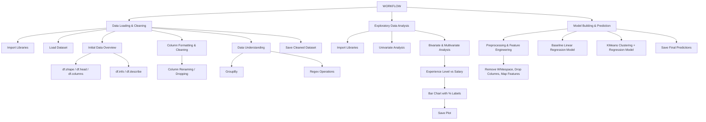

# 📊 Employee Salary Prediction – Project Documentation

This notebook walks through the complete pipeline for predicting employee salaries using a combination of data cleaning, exploratory analysis, and model building approaches including clustering.

---

## 🔁 Workflow Overview



---

## 1️⃣ Data Loading & Cleaning

### 🔹 Code
```python
# Importing essential libraries
import pandas as pd

# Load dataset
df = pd.read_csv('salaries.csv')

# Preview
df.shape
df.head()

# Save cleaned/filtered dataset
save_file = 'filtered_salary.csv'
df.to_csv(save_file, index=False)
```

### 🔹 Explanation

- **Loading**: `pd.read_csv` is used to import raw data.
- **Preview**: We explore data dimensions and top entries using `.shape` and `.head()`.
- **Export**: Cleaned data is saved for next steps.

---

## 2️⃣ Exploratory Data Analysis (EDA)

### 🔹 Code
```python
import matplotlib.pyplot as plt

plt.figure(figsize=(15,5))
el_et_s = df.groupby(['experience_level', 'employment_type'])['salary'].mean()
ax = el_et_s.plot(kind='bar', color='darkorchid')
ax.set_title('Distribution of Salary based on the Experience Level and Employment type')
ax.set_xlabel('Experience Level and Employment Type', fontsize=14, color='black')
ax.set_ylabel('Salary in USD', fontsize=14, color='black')
total = el_et_s.sum()

for i, values in enumerate(el_et_s):
    percent = (values / total) * 100
    percent = percent.round(2)
    plt.text(i, values, f'{percent}%', ha='center', va='bottom')

plt.xticks(rotation=0)
plt.grid()
plt.savefig('images/EDA/Exp_Emp_salary.png')
plt.show()
```

### 🔹 Explanation

- We grouped salaries based on `experience_level` and `employment_type`.
- Used `matplotlib` to visualize the average salary distribution.
- Saved the image for documentation and reporting.

---

## 3️⃣ Model Building & Prediction

### 🔹 Code
```python
from sklearn.model_selection import train_test_split
from sklearn.preprocessing import OneHotEncoder, StandardScaler
from sklearn.compose import make_column_transformer
from sklearn.linear_model import LinearRegression
from sklearn.pipeline import make_pipeline
from sklearn.metrics import mean_absolute_error, mean_squared_error, r2_score, mean_absolute_percentage_error

# Train-Test Split
X_train, X_test, y_train, y_test = train_test_split(X, y, test_size=0.2, random_state=42)

# Preprocessing: Scale numeric, encode categorical
preprocessing = make_column_transformer(
    (StandardScaler(), num),
    (OneHotEncoder(handle_unknown='ignore'), cat),
    remainder='drop'
)

# Pipeline
model = make_pipeline(preprocessing, LinearRegression())

# Train
model.fit(X_train, y_train)

# Predict
y_pred = model.predict(X_test)
```

---

## 4️⃣ KMeans Clustering Model

### 🔹 Code
```python
from sklearn.cluster import KMeans

# Cluster salary values
kmeans = KMeans(n_clusters=3, random_state=42)
df['cluster'] = kmeans.fit_predict(df[['salary']])

# Use cluster for further modeling
X_test_cluster = kmeans.predict(y_test.values.reshape(-1,1))

# Drop cluster label from features
X_test_input = X_test.drop(columns=['cluster'])
```

---

## 🧠 Model Approaches Compared

### ➤ Traditional Linear Regression (Approach 1)

#### 🔸 Explanation
- A single regression model is trained on all data.
- Assumes uniform distribution and linear relation.

#### ✅ Pros
- Easy to train and interpret.

#### ❌ Cons
- Doesn’t account for hidden patterns or non-linear salary variations.

---

### ➤ KMeans Clustering then Regression (Approach 2)

#### 🔸 Explanation
- Cluster salaries into `n` salary bands (e.g., low, mid, high).
- Build cluster-specific models or treat clusters differently.

#### ✅ Pros
- Respects context of salary groupings.
- Better fit for highly variant datasets.

#### ❌ Cons
- Extra complexity.
- Risk of incorrect clusters affecting results.

---

### ➤ Hybrid: Cluster Label as Feature (Approach 3)

#### 🔸 Explanation
- Add cluster label as a feature and train a single regression model.
- Takes advantage of both global and local salary trends.

#### ✅ Pros
- Efficient, simple.
- Uses unsupervised learning to enhance regression.

---

## ✅ Summary Table

| Approach | Cluster Use | Pros | Cons |
|----------|--------------|------|------|
| Linear Regression | ❌ | Simple & Fast | May miss group trends |
| Cluster then Regress | ✅ | Custom-fit models per salary group | More complexity |
| Hybrid Regression | ✅ | Balance of context + simplicity | Needs tuning |

---
