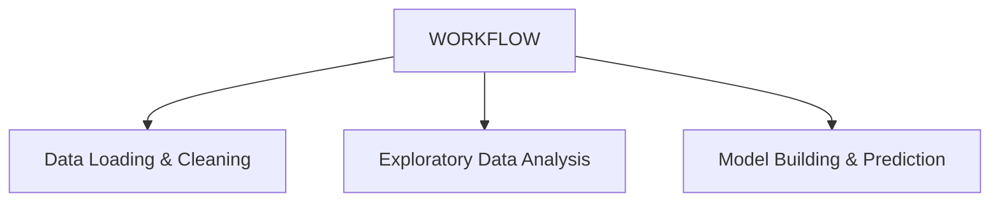

# 🧠 Employee Salary Prediction

## 📌 Project Description

This project aims to predict employee salaries based on various features such as experience, education level, job role, and more. The goal is to build a regression model that accurately estimates salary, which can help HR teams and organizations make data-driven compensation decisions.

The workflow is divided into three main stages:
1. **Data Loading & Cleaning** – Handling missing values, formatting, and data type corrections.
2. **Exploratory Data Analysis (EDA)** – Identifying key patterns, trends, and correlations in the data.
3. **Model Building & Prediction** – Using machine learning algorithms to train and evaluate a regression model. The final output includes predictions compared with actual salaries.

---

## 📊 Dataset

This project uses the publicly available dataset:

🔗 [Salaries for Data Science Jobs – Kaggle](https://www.kaggle.com/datasets/adilshamim8/salaries-for-data-science-jobs)

The dataset contains features such as:
- Job title
- Experience level
- Employment type
- Company size
- Location
- Remote ratio
- Salary (USD)

---

## 💻 System Requirements

To run this project smoothly, ensure the following:

- **Operating System**: Windows 10/11, macOS, or any modern Linux distro
- **Python Version**: 3.8 or higher
- **RAM**: Minimum 4 GB (8+ GB recommended for faster processing)
- **Disk Space**: At least 500 MB free
- **Browser**: Chrome, Firefox, or Edge (for JupyterLab)

### Recommended Tools:
- JupyterLab or Jupyter Notebook
- Git (for version control)
- VSCode or any IDE that supports Python

---

## 📚 Libraries Used

The following Python libraries were used in this project:

### 🧹 Data Handling & Cleaning
- **pandas** – data manipulation and preprocessing
- **numpy** – numerical operations and array handling

### 📊 Data Visualization
- **matplotlib** – base plotting
- **seaborn** – statistical visualization (heatmaps, boxplots, etc.)

### 🤖 Machine Learning
- **scikit-learn** – model selection, preprocessing, evaluation
- **xgboost** – advanced gradient boosting regression model

### 💻 Environment & Utility
- **jupyterlab** – interactive notebook environment
- **os / pathlib / warnings** – general utility libraries
